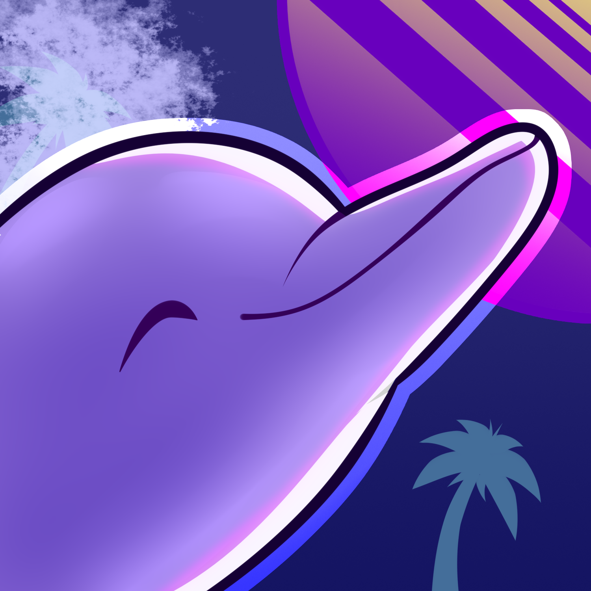

<h1>
   Welcome There, the name's Σxz.
</h1>

  I'm Joshua, Software Engineering enthusiast from  <b>Mexico</b>, currently living in <b>Merida</b>.

<h3>Ask me about</h3>

  
  
  
  
  
  
  
  
  
  
  
  
  
  
  
  
  
  
  
  
  
  
  
  

<h3>
   Who?
</h3>

My name is Joshua Tellez, I've always been fascinated by mathematics, computers and science in general. I firmly believe the grandiose purpose of humanity is to invent and discover.
  
I'm always open for collaborative support on different projects, if the people got what it takes, I'm always up for a challenge and prepared to learn.
 
"No one has more resilience, or matches my practical tactical brilliance"
  
A good team can become even better with great leadership, thankfully, I perform well in both situations. Initiative, respect and creativity can become an incredible workforce.

<h3>
   Highlights
</h3>

<table>
  <thead align="center">
    <tr border: none;>
      <td><b>Projects</b></td>
      <td><b>Tech</b></td>
      <td><b>Status</b></td>
    </tr>
  </thead>
  <tbody>
  <tr>
    <td>
      <a href="https://lindylanguage.expo.app">Lindy Language</a> - A sign language, kid oriented, learning platform.
    </td>
    <td>
      
      
      
      
      
      
      
      
    </td>
    <td>
      
    </td>
  </tr>
  <tr>
    <td>
      <a href="https://github.com/TMJP-E/QuestAPP">QuestAPP</a> - Violence registry, identification and prevention, in a small form.
    </td>
    <td>
      
         
      
      
    </td>
    <td>
      
    </td>
  </tr>
  <tr>
    <td>
      Exzpenser - Personal finances management made simple.
    </td>
    <td>
      
      
         
      
      
      
      
      
      
      
      
      
    </td>
    </td>
    <td>
      
    </td>
  </tr>
  <tr>
    <td>
      <a href="https://github.com/Exzmerald/MegaHQ-MMR">MMR</a> - MegaHQ's official desktop Linux ricing theme.
    </td>
    <td>
      
      
      
      
    </td>
    <td>
      
    </td>
  </tr>
  </tbody>
</table>

<h3>
   Special Interests
</h3>

If anything, Software is not the only thing I like, topics from <b>algebraic structures and discrete mathematics </b> plague my mind.
 
Martial arts and swordsmanship create a focused mentality for the toughest of situations.
 
This connection with computers does not come alone, videogames shaped who I am, ask for my most recent experience.
 
If all fails, a good conversation, exchanging and proposing ideas, something stimulating and engaging can always light up my day.

